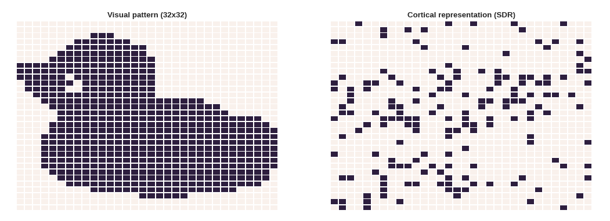

# Humanoids 2017

This repository consists of the data - including scripts, datasets, and images- to reproduce the results of the submitted paper to Humanoids 2017, Invariant object recognition by spatial feature extraction on a humanoid robot. 

> This paper reports our works on invariant object recognition by using the spatial pooling phase of Hierarchical Temporal Memory (HTM) -- a neocortically inspired algorithm.   In order to perform a rotation-invariant recognition task,  we employed this phase in an automatized (not hand-engineered) process to extract features from two datasets. The task was firstly performed on a state-of-the-art image dataset (COIL-100). Then, we construct a new graspable object dataset to accomplish the same task on a robot platform (the iCub humanoid robot) where actual hardware constraints (e.g. camera resolution) and environmental noise (e.g. reflections) exist. To benchmark the proposed method in terms of recognition accuracy, the extracted features and pixel data were used as inputs to a set of recognition algorithms with different amounts of training data (from 5 to 80%).  The results show that the proposed method is effective for robotic applications involving rotation-invariant object recognition with low amount of training data. This work represents a first step towards multimodal learning for invariant object recognition.  

## Folders and descriptions  
**0- Spatial-pool-framework:**  This folder contains the framework used for feature extraction phase of the implemented pipeline. The framework adapted and modified based on following studies[1][2]. A visual pattern and the generated cortical representation of it are shown in the figure below. 

	

## References
[1] Hawkins, J., Ahmad, S., and Dubinsky, D. (2011). [Hierarchical Temporal Memory Including htm Cortical Learning Algorithms.](http://numenta.org/resources/HTM_CorticalLearningAlgorithms.pdf)  
[2] Mnatzaganian J, Fokoué E and Kudithipudi D (2017) A Mathematical Formalization of Hierarchical Temporal Memory’s Spatial Pooler. Front. Robot. AI 3:81. [doi: 10.3389/frobt.2016.00081](http://10.3389/frobt.2016.00081) 
